# 基于springboot的智慧云相册

#### 介绍
springboot+Android双端相册，web端使用springboot和layui，使用阿里云通用ai识别接口实现图片聚类，使用时需要自己注册阿里云接口并在FaceImpl.java程序中进行替换才能使用

#### 软件架构
结构示意图

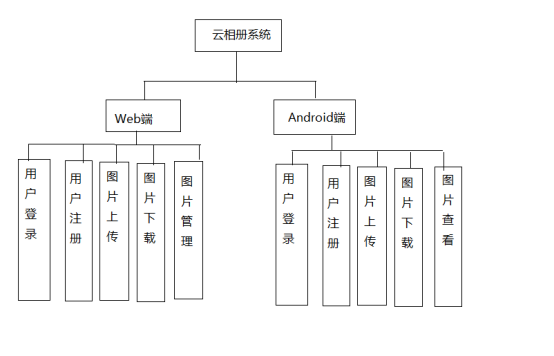

#### 安装教程

1.  数据库名称为 `photo_album`,编码我utf8,在navicat中运行`photo_album.sql`文件
2.  启动web端的程序后即可访问web页面
3.  启动安卓端app后访问app界面

#### web软件功能

1.  登录注册

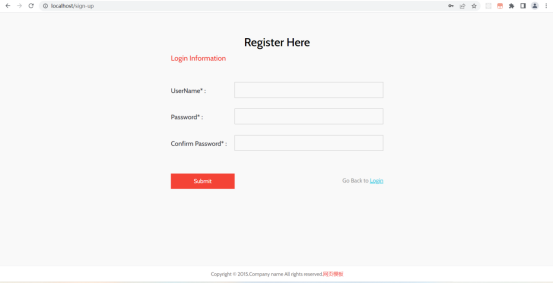

2.  查看云端相册

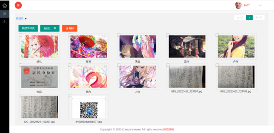
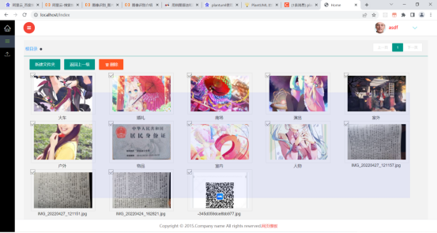

3.  上传图片功能

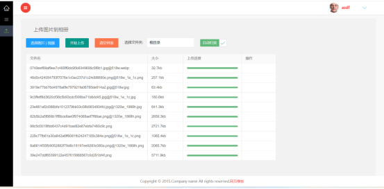

4. 鼠标右键功能

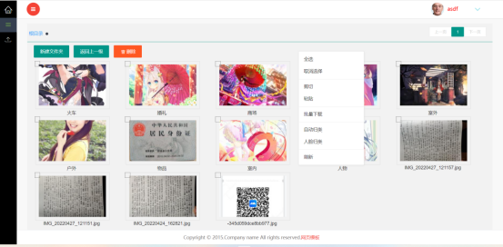

#### 安卓软件功能

1.  查看系统图片

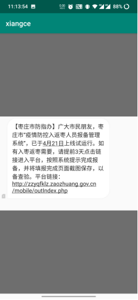

2.  用户注册

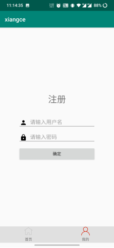

3.  用户登录

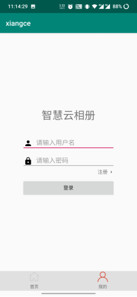

4. 上传图片

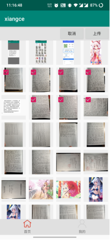

5. 云空间查看图片

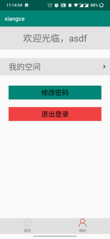
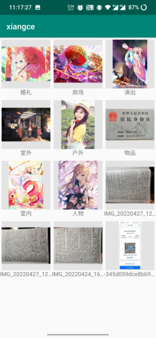

6. 下载图片

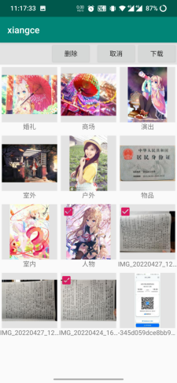

7. 删除图片

在云相册查看界面长按后可以弹出删除按钮，选择图片或文件夹后，点击删除按钮，就可以删除图片或文件夹。

#### 数据库

1.  数据库总体结构

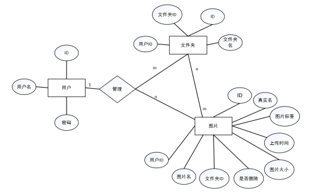

2.  数据库字段说明

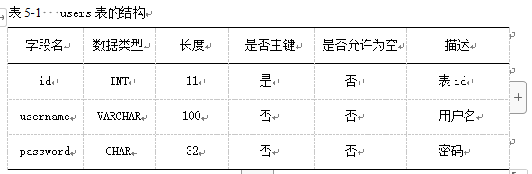
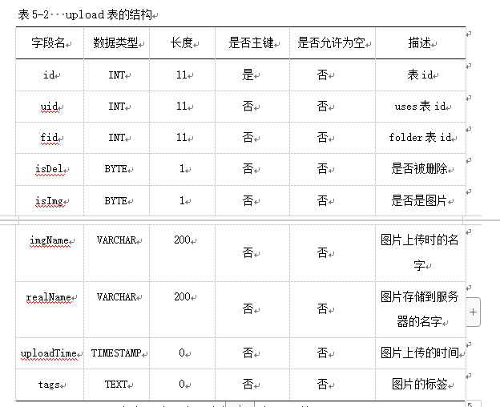
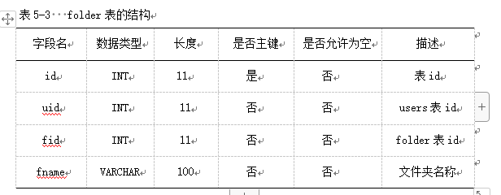

#### 特技

1.  使用 Readme\_XXX.md 来支持不同的语言，例如 Readme\_en.md, Readme\_zh.md
2.  Gitee 官方博客 [blog.gitee.com](https://blog.gitee.com)
3.  你可以 [https://gitee.com/explore](https://gitee.com/explore) 这个地址来了解 Gitee 上的优秀开源项目

